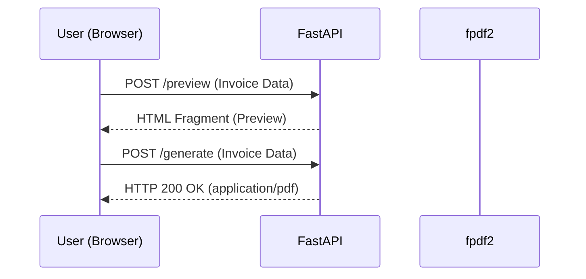

# DESIGN.md - Nami-Seikyu (波請求)

## 1. Vision & Philosophy
Nami-Seikyu（波請求）は、ビジネスにおける「お金の流れ」を**波**（Nami）のように淀みなく、スムーズに整えるための請求書発行システムです。
また、請求業務という複雑になりがちなプロセスを、誰もが当たり前にこなせる**並**（Nami）の所作へと標準化し、簡潔に保つことを目指しています。

SREの視点に基づき、以下の3原則を設計の柱とします。

- **Simplicity**: データベースを持たず、ステートレスな変換器として動作。htmxによる洗練された操作感。
- **Speed**: `fpdf2` による高速なPDF生成。波が引くように素早く書類を完成させる。
- **Portability**: 純粋なPythonライブラリのみで構成し、外部環境に左右されないポータビリティを実現。

## 2. Technical Stack

| Category | Technology | Reason |
| :--- | :--- | :--- |
| **Runtime** | Python 3.12 (Slim-bookworm) | パフォーマンスとエコシステムのバランス。 |
| **Package Manager** | uv | 依存関係解決の高速化と、一元管理。 |
| **Framework** | FastAPI | 型安全性（Pydantic）による入力バリデーションの容易さ。 |
| **Frontend** | htmx + Tailwind CSS | インタラクティブな操作を最小のJSで実現。 |
| **PDF Engine** | fpdf2 | 純粋なPython実装。ポータビリティとフォント埋め込みの容易さ。 |
| **Infrastructure** | Podman / Compose | 512MB以下の低リソース環境でも動作可能。 |

## 3. System Architecture

### Component Diagram
1. **Frontend**: 入力フォーム。ライブプレビュー機能により、仕上がりをリアルタイムに確認。
2. **API Layer**: FastAPIが Form データを受け取り、Pydanticモデルでバリデーション。
3. **Engine**: `fpdf2` がデータに基づいて請求書のレイアウトを描画。
4. **Response**: 生成されたバイナリを `application/pdf` として即時ダウンロード。

## 4. Data Flow (Sequence)



## 5. Directory Structure

```text
nami-seikyu/
├── pyproject.toml
├── main.py             # FastAPI entrypoint & routes
├── app/
│   ├── services/       # Invoice generation (fpdf2 logic)
│   ├── models/         # Pydantic schema (Invoice, Item)
│   └── utils/          # Seal generation (Pillow)
├── static/             # Fonts & Assets
└── templates/
    ├── index.html      # Main layout
    └── fragments/      # htmx components
```

## 6. SRE & Operational Considerations

- **Resource Management**:
  メモリ消費を抑え、ステートレスに保つことで、水平スケーリングが容易な設計。
- **Security**:
  入力データは保存せず、生成後のPDFはストリームとして返すことで、データ漏洩リスクを最小化する。
- **Observability**:
  平均生成時間、ファイルサイズ、リクエスト成功率をメトリクスとして収集。
